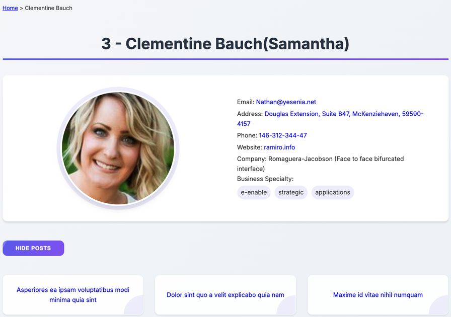

# Name/Value Pair Test

## 📋 Опис

Інтерактивний веб-додаток для управління парами "ім'я=значення" з модульною JavaScript архітектурою.

### Головний екран додатку


## 🔥 Функціональність

- ✅ Додавання нових пар "ім'я=значення" через форму введення
- ✅ Сортування пар за ім'ям або значенням
- ✅ Пошук пар за ім'ям або значенням
- ✅ Вибір і видалення декількох пар одночасно
- ✅ Перегляд видалених пар у модальному вікні
- ✅ Відновлення видалених пар
- ✅ Сортування видалених пар за датою видалення
- ✅ Пошук по видалених парах
- ✅ Локальне збереження даних між сесіями

## 💻 Технічні особливості

- 🔗 Модульна архітектура JavaScript з розділенням відповідальності
- 🛡️ Валідований користувацький ввід
- 📱 Адаптивний дизайн
- 💾 Використання localStorage для збереження даних
- 🔍 Реалізація фільтрації та сортування
- 🔘 Інтерактивні елементи керування (чекбокси, модальне вікно)
- ⌨️ Обробка клавіатурних подій (Esc для закриття модального вікна)
- 🔄 Динамічне оновлення інтерфейсу користувача

## 📂 Структура проєкту

```
/
├── js/
│   ├── main.js            # Основний файл з логікою додатка
│   ├── utils/             # Утиліти для валідації та генерації ID
│   ├── ui/                # Функції для відображення елементів інтерфейсу
│   └── helpers/           # Допоміжні функції для роботи з даними
├── css/
│   ├── styles.css         # Основні стилі
│   ├── variables.css      # CSS-змінні
│   └── adaptive.css       # Адаптивні стилі
├── favicon_io/            # Іконки сайту
└── index.html             # Головний HTML-файл
```

## 🚀 Використання

1. Введіть пару у форматі "ім'я=значення" у поле введення
2. Натисніть "Add" або Enter для додавання пари
3. Використовуйте чекбокси для вибору пар
4. Скористайтеся сортуванням або фільтрацією для організації пар
5. Видаліть вибрані пари за допомогою кнопки "Delete"
6. Переглядайте та відновлюйте видалені пари через модальне вікно

## 🔧 Встановлення

```bash
# Клонувати репозиторій через SSH
git clone git@github.com:kharchenkok/okten-JS-exam.git

# Або через HTTPS
git clone https://github.com/kharchenkok/okten-JS-exam.git

# Перейти у директорію проекту
cd okten-JS-exam

# Відкрити index.html у браузері або використати live-server
```

